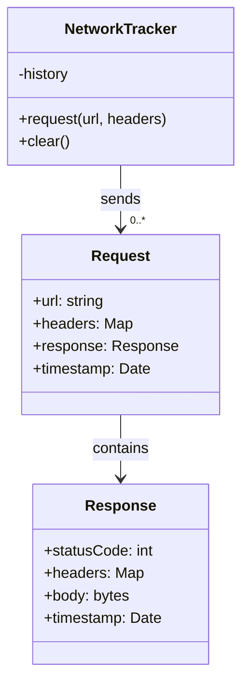

The network developer tool is a useful tool provided by the browsers to track the requests made by a web page. It can be used to debug the content of a POST request, to analyze which images we download, the headers etc...

Today, I want to implement the feature in Dragonfly. It will also be very useful to me to know if the browser is currently downloading the CSS and JS files and the images.

# The concept

The browser has a bunch of tabs. Each of these tabs must have its own HTTP client. It will improve the security.

I'm taking the case of a single tab. The tab must have an object and all the request must be done by this object. Let's call it `NetworkTracker` for now. I'm expecting the following methods :

- `request(url, headers)` : it's the most important method. It runs an HTTP request to the specified URL with the headers and the cookies. It saves the request into the history. The request in the history will contain all the information of the request and the response with some time measurements.

- `clear()` : we clear the history. The history is linked to a single page. We navigate, we clear.

It will also has some private methods associated to the cache. 

Here is the class diagram of what I expect to build:



Now, we can write a bit of code! This is the translation of the class diagram :

```dart
import 'dart:typed_data';

class NetworkTracker {
  late final List<NetworkRequest> history;

  NetworkTracker() {
    history = [];
  }

  Future<NetworkResponse?> request(
    String url,
    Map<String, String> headers,
  ) async {
    try {
      return NetworkResponse(
        statusCode: 200,
        headers: headers,
        body: Uint8List(0),
      );
    } catch (e) {
      return null;
    }
  }

  void clear() {
    history.clear();
  }
}

class NetworkRequest {
  late final NetworkResponse? response;
  final String url;
  final Map<String, String> headers;
  late final DateTime timestamp;

  NetworkRequest({required this.url, required this.headers}) {
    timestamp = DateTime.now();
  }
}

class NetworkResponse {
  final int statusCode;
  final Map<String, String> headers;
  final Uint8List body;
  late final DateTime timestamp;

  NetworkResponse(
      {required this.statusCode, required this.headers, required this.body}) {
    timestamp = DateTime.now();
  }
}
```

Nothing crazy so far. I can see some little change I need to do now. Because I want to test this class, I must be able to pass a special HTTP object to mock the requests and also, if we watch more carefuly the request method, we don't know which kind of HTTP requests the browser wants. A bit of dependency injection and a little change after :

```dart
late final http.Client httpClient;

// We pass a special http client here during the testing
NetworkTracker({
    http.Client? httpClient,
}) {
    history = [];
    this.httpClient = httpClient ?? http.Client();
}

Future<NetworkResponse?> request(
    String url,
    String method,
    Map<String, String> headers,
) async {
    ...
}
```

I think we have the scaffold of the class. Now I can write the first test. I will test the `clear` method first.

```dart
import 'package:dragonfly_navigation/src/utils/network_tracker.dart';
import 'package:test/expect.dart';
import 'package:test/scaffolding.dart';
import 'package:http/http.dart' as http;

class HTTPClientMock extends http.BaseClient {
  final List<http.StreamedResponse> _responses;
  int _currentIndex = 0;

  HTTPClientMock(this._responses);

  @override
  Future<http.StreamedResponse> send(http.BaseRequest request) {
    final response = _responses[_currentIndex];
    _currentIndex++;

    return Future.value(response);
  }
}

void main() {
  group(
    "Network tracker",
    () {
      test(
        "Clear the history",
        () {
          final tracker = NetworkTracker(httpClient: HTTPClientMock([]));

          tracker.history.add(
            NetworkRequest(
              url: "random url",
              headers: {},
            ),
          );

          expect(tracker.history.length, 1);
          tracker.clear();
          expect(tracker.history, isEmpty);
        },
      );
    },
  );
}
```

I've created the class `HTTPClientMock`. It's doing the same thing than a normal `HTTPClient` but it doesn't actually make a request. It returns a predefined list of StreamedResponse so I, the tester, can have a full control over the mocked requests.

What about a bit of TDD? 

```dart
test("Very basic GET request ; no headers", () async {
  final tracker = NetworkTracker(
    httpClient: HTTPClientMock(
      [
        http.StreamedResponse(
          Stream.fromIterable(
            [],
          ),
          200,
        ),
      ],
    ),
  );

  final response = await tracker.request("url", "GET", {});

  expect(tracker.history.length, 1);

  expect(response, isNotNull);
  expect(response!.statusCode, 200);
  expect(response.headers, isEmpty);
  expect(response.body, isEmpty);
});
```

It looks heavy. First, I define the HTTP response I want.The first response will have the status code 200 and the body will be empty. We expect the history to have 1 element and the response to have the status code 200, no headers and an empty body too.


```dart
final request = http.Request(
    method,
    Uri.parse(url),
);

for (var v in headers.entries) {
    request.headers[v.key] = v.value;
}

final networkRequest = NetworkRequest(
    url: url,
    headers: headers,
);

history.add(networkRequest);

final response = await httpClient.send(
    request,
);

final responseBody = await response.stream.toBytes();

final responseToReturn = NetworkResponse(
    statusCode: response.statusCode,
    headers: response.headers,
    body: responseBody,
);

return responseToReturn;
```

The method builds the request with the header. He creates a `NetworkRequest` and stores it into the history. Then the requests is made. We consume all the stream and keeps the result as the body. Finally, it builds the `NetworkReponse` and returns it,

I just noticed the `NetworkResponse` wasn't stored inside the `NetworkRequest`. This is the fix :

```dart
networkRequest.response = responseToReturn;
```

We could talk about immubility here. Good practice would require to set the `networkRequest.response` as `final` and use a function like `copyWith()`
