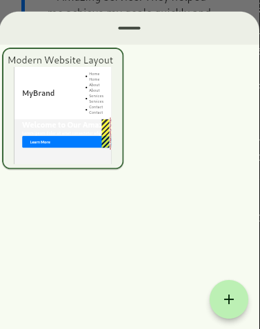

This month, I have implemented a lot of interesting features in the browser. Let's see what's new!

## Browser Interface

I have worked a lot on the UI. It's not perfect, but I think it's good enough for now. Thanks to *Flutter*, it's very easy to build something modern and with nice interactions.

First, the tabs! They can be pinned, and they can be reordered with drag & drop. It's similar to Chrome or Firefox.

I added some customization. In the settings page, you can set your own color for the Material theme and choose if you prefer a dark theme or light theme.

There's also a command palette (`CTRL+P`) à la VSCode. You can open the history or settings with it. It will have more and more features in the future.

When we hover over a link, we can see the destination in the bottom left corner.

It's **responsive**! You can resize the window, and the browser will adapt the layout. This means the browser can be used on **mobile**.

## HTML Rendering

It can render **forms**! This is the list of form elements it can render:
- `<form>`
- `<textarea>`
- `<input type="hidden">`
- `<input type="text">`
- `<input type="password">`
- `<input type="file">`
- `<input type="checkbox">`
- `<input type="radio">`
- `<input type="submit">`
- `<input type="reset">`

When an `<input type="submit">` is pressed, it will send the form to the form's destination. It’s not yet sending files because it needs some special headers.

The checkboxes and radios are not interactive yet. I still don't know where to store their values—should it be in the DOM? In the render tree? Somewhere in the `HTMLPage` object?

## Developer Tools

I've implemented most of the developer tools I could in *Dragonfly*. Even though they are made for web developers, it's absolutely necessary to develop the browser easily. I had tons of issues with the rendering of HTML pages and the same with all the HTTP requests.

They work quite well. Of course, they are not perfect. They have bugs, but at least they can be used!

To open the developer tools menu, simply press `F12`.

### Inspector Tool

The inspector tool is very useful to visualize the HTML. It shows all the HTML code in a kind of tree structure where we can collapse/expand each leaf. It's generated thanks to the DOM. Thanks to that, it can also duplicate and remove DOM nodes.

A very important feature is that we can hover over an element of the HTML tree and directly see where it is in the browser. We can visualize the margin and padding of each element!

Another cool feature is that we can read the values of the margin, padding, and border! It's a very important piece of information because most of the rendering errors I currently have originate from them.

### Network Tool

Another very useful tool for me! When we navigate to an HTML page, we have to download it, download the CSS, the JavaScript, the favicon, the images, etc. It's impossible to know all the requests made by a single page.

So here is the network tool! Every HTTP request made by the browser goes through a `NetworkTracker`. It injects the browser headers and keeps a history of the requests made by one page.

It supports caching but in a very simple way. If the `Cache-Control` header is present, we cache it. There's no system to monitor the lifetime of a cached element.

We can view the URI of a request, the method, the status code, the resource size, the request duration, and more. If you click on a request, you can see the request and response headers.

Thanks to the `NetworkTracker`, I run all the requests in parallel, making the browser much faster.

### Stylesheet Tool

It shows all the stylesheets of a webpage. We can see the content of each one by clicking on it.

We can't modify a stylesheet yet.

### Responsive Mode

It's a very basic way to simulate mobile on desktop. The "mobile" button in the dev tools menu activates responsive mode.

You can set the dimensions of the viewport to match a phone, and there's a small button to flip the dimensions.

## Other Features

The browser now has a JSON visualizer. Drop your JSON in the window, and it will open it!

I've been experimenting. I wrote the foundation of a **CSS parser**. It's almost like the `csslib` package. I learned a lot, so I'll soon replace the current parser, which uses `petitparser`, with either my own parser or `csslib`. It will be faster and better for error handling.

I also tried to write a very basic mathematics evaluator. I wrote it to learn how to write an interpreter, but I lack the knowledge. It's not critical. The final goal is to have a JS interpreter written in Dart (probably not a great idea).

Lastly, I did a lot of refactoring and fixed many bugs...

## Thanks
- **brainwoo**: fixed the `puro.yaml`
